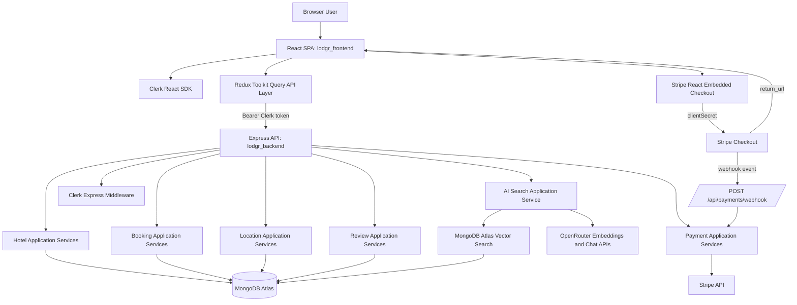

# Lodgr

## Abstract
Lodgr is a full-stack hotel booking application that combines a React frontend, an Express and MongoDB backend, Clerk authentication, Stripe checkout, and OpenRouter-powered semantic hotel search. The project addresses the problem of discovering, filtering, booking, and managing hotel stays through both traditional form-based search and natural-language AI recommendations. Its implementation demonstrates layered backend architecture, API-driven frontend state management, payment lifecycle handling, role-based administration, and MongoDB Atlas Vector Search integration. The main learning outcomes are the coordination of external services, the separation of domain logic from transport code, and the practical tradeoffs involved in deploying a multi-service JavaScript application.

## Table of Contents
- [1. Project Overview](#1-project-overview)
- [2. System Architecture](#2-system-architecture)
- [3. Development Journey](#3-development-journey)
- [4. Technical Implementation](#4-technical-implementation)
- [5. Technologies & Dependencies](#5-technologies--dependencies)
- [6. Security Considerations](#6-security-considerations)
- [7. Installation & Setup](#7-installation--setup)
- [8. Usage](#8-usage)
- [9. Learning Outcomes](#9-learning-outcomes)
- [10. Challenges & How They Were Solved](#10-challenges--how-they-were-solved)
- [11. Known Limitations & Future Improvements](#11-known-limitations--future-improvements)
- [12. Project Structure](#12-project-structure)
- [13. Potential Interview Questions](#13-potential-interview-questions)
- [14. References & Resources](#14-references--resources)

## 1. Project Overview
Lodgr is a hotel discovery and booking system. The frontend lets visitors browse featured hotels, filter by destination and quality signals, use AI search, authenticate with Clerk, book rooms, pay through Stripe, and view booking history. Admin users can create new hotels through a protected form that supports URL-based images and images selected from the local machine.

The project demonstrates a portfolio-grade booking workflow rather than a minimal CRUD application. It includes domain models for hotels, bookings, locations, and reviews, plus payment and AI search flows that require coordination between the browser, backend, MongoDB, Stripe, Clerk, and OpenRouter.

The intended audience is a university or portfolio evaluator who wants to inspect practical full-stack engineering work. The implementation is suitable as an educational and demonstration project. Some production concerns are addressed, such as environment variables, webhook signature verification, authentication middleware, deployment rewrites, and CORS configuration, while other production concerns remain listed in [Known Limitations & Future Improvements](#11-known-limitations--future-improvements).

Key technologies were chosen for observable reasons in the code:

- React 19 and Vite are used in `lodgr_frontend` to provide a component-based single-page application with fast local development and static production builds.
- React Router 7 is used for browser routes such as `/hotels`, `/hotels/:_id`, `/my-account`, and `/booking/payment`.
- Redux Toolkit Query is used in `src/lib/api.js` to centralize API calls, token attachment, cache invalidation, and loading/error state.
- Clerk is used instead of a custom user table. Backend routes use `getAuth(req)` from `@clerk/express`, and frontend screens use Clerk React components and user metadata.
- Express 5 is used for HTTP routing because the backend exposes REST-style endpoints with middleware composition.
- Mongoose is used because the domain entities are MongoDB documents with schemas, indexes, timestamps, references, and model-level serialization behavior.
- Stripe Checkout is used because booking payment requires a hosted payment flow, payment status retrieval, and webhook confirmation.
- OpenRouter is used for embeddings and chat completion calls in the AI hotel search feature.
- MongoDB Atlas Vector Search is used for semantic retrieval over stored hotel embeddings.
- Tailwind CSS 4, Radix UI primitives, shadcn-style components, and lucide-react are used to build the visual interface with reusable UI primitives.

## 2. System Architecture


The system is split into two deployable applications:

- `lodgr_frontend` is a React single-page application. It owns UI rendering, route transitions, form validation, client-side state, and Clerk browser authentication.
- `lodgr_backend` is an Express API. It owns persistence, backend validation, authorization, payment session creation, webhook handling, AI retrieval, and database seeding.

The backend follows a layered structure:

- API layer: files in `lodgr_backend/src/api` define Express routers and middleware.
- Application layer: files in `lodgr_backend/src/application` implement business use cases.
- Domain layer: files in `lodgr_backend/src/domain` define DTO validation schemas and custom errors.
- Infrastructure layer: files in `lodgr_backend/src/infrastructure` define database connectivity and Mongoose entities.
- Utility layer: `src/utils/createEmbeddings.ts` isolates the OpenRouter embedding call.

The frontend follows a component and page structure:

- Route entry point: `src/main.jsx` configures `ClerkProvider`, Redux `Provider`, `BrowserRouter`, and all routes.
- Layouts: `RootLayout.jsx`, `ProtectLayout.jsx`, and `AdminProtectLayout.jsx` compose shared navigation, footer, authentication gates, and admin gates.
- Pages: files in `src/pages` represent route-level screens.
- Components: files in `src/Components` provide booking, hotel, navigation, AI search, and reusable UI components.
- State and data access: `src/lib/api.js`, `src/lib/store.js`, and `src/lib/features/searchSlice.js` centralize API calls and cross-component search state.

Request and data flow:

1. A visitor opens the React application through Vite or a static deployment.
2. React Router renders a route inside `RootLayout`.
3. For API data, components call RTK Query hooks from `src/lib/api.js`.
4. `api.js` attaches a Clerk session token when available by calling `window.Clerk.session.getToken({ skipCache: true })`.
5. The Express server receives requests under `/api`.
6. `clerkMiddleware()` populates authentication context.
7. Route-level middleware such as `isAuthenticated` or `isAdmin` enforces access rules where applied.
8. Application services validate input with Zod DTOs and read or write Mongoose models.
9. Responses return JSON to RTK Query, which updates component state and cache tags.
10. Payment-specific requests create a Stripe Checkout session, then Stripe confirms status through either the return flow or the webhook.
11. AI search-specific requests create a query embedding, run `$vectorSearch` against MongoDB Atlas, then ask OpenRouter to summarize the matched hotels.

The main architectural pattern is layered architecture. The backend routers do not contain most business logic; they delegate to application functions such as `createBooking`, `getAllHotels`, `createCheckoutSession`, and `respondToAIQuery`. The frontend uses container pages and smaller reusable components, with RTK Query functioning as a client-side data access layer.

## 3. Development Journey
The current repository preserves evidence of several implementation stages.

The earliest visible frontend foundation is a Vite React application. Files such as `lodgr_frontend/src/App.css`, `lodgr_frontend/public/vite.svg`, and `lodgr_frontend/src/assets/react.svg` remain from the starter template, although the active application is now routed through `src/main.jsx` and page components.

The project then gained static hotel browsing concepts. `src/data/hotelData.js` contains local hotel and location objects, which indicates an earlier frontend-only data phase. The current application no longer depends on this file for the main hotel listings; the active listings use backend endpoints through RTK Query.

The backend introduced persistent domain models through Mongoose. `Hotel`, `Booking`, `Location`, and `Review` schemas define the central data types. This moved the project from static display to API-driven persistence and allowed bookings, locations, reviews, and search filters to be stored and queried.

Authentication and role-based access were added through Clerk. The backend uses `@clerk/express` middleware and `getAuth(req)`, while the frontend wraps the application in `ClerkProvider`. Admin-only hotel creation is enforced in both `AdminProtectLayout.jsx` and the backend `isAdmin` middleware for `POST /api/hotels`.

Hotel data was expanded through `lodgr_backend/src/seeds/seed.ts`. The seed contains a large curated list of static hotels, gallery URLs, amenity sets, location creation, and optional embedding generation. This change solved the limitations of small local mock data and gave the application enough data for filtering and AI search.

The AI search milestone added `createEmbeddings.ts`, `application/ai.ts`, an Atlas Vector Search index plan in `docs/atlas-vector-search-index.md`, and frontend AI search components. The design changed from keyword-only discovery to semantic discovery by storing embeddings on hotels and querying them through MongoDB Atlas.

Stripe payment integration added booking payment state transitions. `Booking` includes `paymentStatus`, Stripe session identifiers, and payment intent identifiers. `application/payment.ts` creates embedded-page checkout sessions, confirms sessions, and handles signed webhooks for completed and expired checkout sessions.

The UI was later refined into a branded booking interface. The active navigation, footer, featured hotel cards, hotel details, booking history cards, admin create form, and payment pages are all implemented in `src/Components` and `src/pages`. The design uses reusable button, card, dialog, form, input, label, skeleton, switch, textarea, and badge primitives.

Deployment-specific changes are visible in `vercel.json` at the repository root and frontend folder. Both rewrite all paths to `/index.html`, which is necessary because the frontend uses `BrowserRouter`; direct refreshes on nested routes would otherwise return 404 from a static host.

## 4. Technical Implementation
### Backend Entry Point
`lodgr_backend/src/index.ts` is the backend entry point. It loads environment variables, configures CORS, registers the Stripe webhook route before `express.json()`, installs Clerk middleware, mounts API routers, connects to MongoDB, and starts the server on `process.env.PORT || 8000`.

The webhook route is intentionally registered before JSON parsing because Stripe signature verification requires the raw request body. This is a security-sensitive implementation detail in `app.post("/api/payments/webhook", express.raw({ type: "application/json" }), handleStripeWebhook)`.

### Database Connection
`lodgr_backend/src/infrastructure/db.ts` defines `connectDB`. It reads `MONGODB_URL`, throws when it is absent, and calls `mongoose.connect`. On connection failure it logs the error and exits the process. This keeps database startup failure explicit rather than allowing the API to run without persistence.

### Hotel Entity and Hotel Services
`lodgr_backend/src/infrastructure/entities/Hotel.ts` defines the hotel document. It stores public fields such as `name`, `location`, `image`, `gallery`, `description`, `price`, `rating`, `amenities`, `tags`, `starRating`, `guestScore`, `featured`, `neighborhood`, and `country`. It also stores `searchText` and `embedding` with `select: false`; `toJSON` deletes `embedding` before responses are serialized.

`lodgr_backend/src/application/hotels.ts` implements hotel use cases:

- `getAllHotels` converts query parameters into MongoDB filters for location, price, rating, amenities, tags, featured status, star rating, guest score, and text-like search across hotel fields.
- Sorting supports `price-asc`, `price-desc`, `rating-desc`, `guest-desc`, `name-asc`, and a default rating sort.
- Pagination is enabled only when the `page` query parameter is present. The limit is clamped between 1 and 48.
- `createHotel` validates input with `CreateHotelDTO`, builds `searchText`, optionally creates an embedding when `OPENROUTER_API_KEY` is present, saves the hotel, and upserts a `Location` from `country || location`.
- `updateHotel` rebuilds `searchText` after replacement-style updates.
- `patchHotel` currently requires and updates `price`.
- `deleteHotel` removes a hotel by id.

This module applies single-responsibility separation: route handlers only connect HTTP to application functions, while filtering, validation, enrichment, and persistence live in the service layer.

### Booking Entity and Booking Services
`lodgr_backend/src/infrastructure/entities/Booking.ts` defines a booking with `userId`, `hotelId`, `checkIn`, `checkOut`, `roomNumber`, `totalAmount`, `paymentStatus`, `stripeCheckoutSessionId`, and `stripePaymentIntentId`. It indexes user history queries and hotel-room-date lookup.

`lodgr_backend/src/application/booking.ts` implements booking logic:

- `createBooking` verifies Clerk authentication, validates dates with `CreateBookingDTO`, rejects checkout dates before check-in dates, verifies that the hotel exists, calculates `totalAmount` from hotel price and night count, generates an available room number, and creates a pending booking.
- `generateRoomNumber` attempts random room numbers between 100 and 999 and rejects numbers that overlap an existing non-failed booking for the same hotel and date interval.
- `getBookingsByUserId` prevents users from reading another user's bookings.
- `getBookingById` checks booking ownership.
- `deleteBooking` rejects cancellation of paid bookings and allows deletion of non-paid bookings.

The logic favors clear application-level checks. The tradeoff is that random room assignment is not transactionally locked, so concurrent high-volume booking would need stronger database constraints or transactional reservation logic.

### Location Entity and Location Services
`Location.ts` stores location names. `application/location.ts` exposes CRUD-style functions and also synchronizes hotel countries into the location collection in `getAllLocations`. This means a newly created hotel with a new country can appear in filter options after locations are fetched.

### Review Entity and Review Services
`Review.ts` stores `rating`, `comment`, and `userId`. `application/review.ts` creates reviews after verifying the target hotel exists and pushes the new review id into `Hotel.reviews`. `getReviewsByHotelId` fetches a hotel and populates its `reviews` array.

The current review model does not store `hotelId` directly. This keeps the relationship embedded through the hotel document but makes reverse review queries dependent on the hotel reference array.

### DTO Validation and Errors
`src/domain/dtos` uses Zod to validate hotel and booking input. `CreateHotelDTO` defines hotel creation shape, `CreateBookingDTO` validates booking creation, and `UpdateBookingDTO` validates editable booking fields.

`src/domain/errors` defines `NotFoundError`, `ValidationError`, and `UnauthorizedError`. `global-error-handling-middleware.ts` maps these error types to HTTP response statuses and returns `500 Internal Server Error` for unknown errors.

### Authentication and Authorization
`authentication-middleware.ts` uses `getAuth(req)` to require a Clerk `userId`. `authorization-middleware.ts` checks for an admin role in Clerk claims and, if necessary, fetches the Clerk user to inspect `publicMetadata.role`.

This design avoids maintaining a separate MongoDB user table. The tradeoff is that role management depends on Clerk metadata correctness and token freshness.

### Payment Services
`lodgr_backend/src/application/payment.ts` integrates Stripe:

- `createCheckoutSession` verifies the authenticated user owns the booking, rejects already paid bookings, creates a Stripe Checkout session with `ui_mode: "embedded_page"`, and stores the session id on the booking.
- `confirmCheckoutSession` retrieves a Stripe session, checks metadata ownership, and marks the booking paid if Stripe reports `payment_status === "paid"`.
- `handleStripeWebhook` verifies the Stripe signature and handles `checkout.session.completed` and `checkout.session.expired`.

The payment lifecycle uses both user-return confirmation and webhook confirmation. This is important because users may close the payment page or return later, while webhooks provide server-to-server status updates.

### AI Search and Embeddings
`lodgr_backend/src/utils/createEmbeddings.ts` sends embedding requests to `https://openrouter.ai/api/v1/embeddings`. It requires `OPENROUTER_API_KEY`, uses `OPENROUTER_EMBEDDING_MODEL` or a default, validates the provider response, and returns arrays of numbers.

`lodgr_backend/src/application/ai.ts` uses this function for natural-language hotel search. It validates the query, generates an embedding, runs MongoDB Atlas `$vectorSearch` against the `embedding` field, projects a vector score, and asks OpenRouter chat completion to produce a concise explanation based only on matched hotels.

The associated documentation in `docs/atlas-vector-search-index.md` recommends an Atlas Vector Search index named `hotel_embedding_index` on `Hotel.embedding` with `numDimensions: 2048` and cosine similarity. The source code reads the index name from `ATLAS_VECTOR_INDEX` when provided.

### Seed Script
`lodgr_backend/src/seeds/seed.ts` is a destructive reseed script. It defines static curated hotels, builds gallery URLs, creates searchable text, optionally creates embeddings in batches of 16, validates embedding dimensions when `OPENROUTER_EMBEDDING_DIMENSIONS` is set, clears bookings, hotels, locations, and reviews, inserts locations, and inserts hotels.

This script supports repeatable development data. Because it deletes collections, it is suitable for local or controlled demo environments rather than a production database.

### Frontend Entry Point and Routing
`lodgr_frontend/src/main.jsx` checks `VITE_CLERK_PUBLISHABLE_KEY`, then wraps the application in `ClerkProvider`, Redux `Provider`, and `BrowserRouter`.

Routes are declared directly:

- `/` renders `HomePage`.
- `/sign-in` and `/sign-up` render Clerk pages.
- `/hotels` renders `HotelsPage`.
- `/hotels/:_id`, `/my-account`, `/booking/payment`, and `/booking/payment/complete` require `ProtectLayout`.
- `/admin/create-hotel` requires both `ProtectLayout` and `AdminProtectLayout`.
- `*` renders `NotFoundPage`.

### Frontend API Layer
`src/lib/api.js` uses Redux Toolkit Query. It defines a `fetchBaseQuery` with `baseUrl` from `VITE_BACKEND_URL` or localhost. It waits for Clerk session availability, attaches a bearer token, and defines hotel, location, booking, payment, review, and AI endpoints.

The file uses cache tags such as `Hotels`, `Locations`, and `Bookings`. Mutations that change data invalidate related tags, causing dependent screens to refetch.

### Search State
`src/lib/features/searchSlice.js` stores the active AI search query. `AISearch.jsx` updates this slice, and `HotelsView.jsx` chooses between standard hotel listings and AI search results based on whether a query is active.

### Home and Hotel Browsing
`HomePage.jsx` renders the homepage and contains a payment return workaround: when `payment_session_id` appears in the URL, it renders `BookingCompletePage`.

`HotelListings.jsx` renders the homepage AI feature explanation, featured stays, and destination selector. Featured hotels are loaded from `GET /api/hotels?featured=true&limit=8`.

`HotelsPage.jsx` implements the full listing page with filters for location, price range, rating, star rating, guest score, amenities, tags, featured status, and sort order. It uses `getAllHotels` and `getAllLocations`.

`HotelDetailsPage.jsx` loads a single hotel, displays gallery and facts, and creates a booking by calling the backend directly with a Clerk token. On successful booking creation, it shows a toast and navigates to `/booking/payment?bookingId=...&created=1`.

### Booking and Payment UI
`BookingDialog.jsx` and `BookingForm.jsx` provide date selection and validation. `BookingPaymentPage.jsx` displays booking summary and a confirmation banner when a new booking was created. `CheckoutForm.jsx` initializes Stripe Embedded Checkout using `VITE_STRIPE_PUBLISHABLE_KEY` and obtains a client secret from the backend.

`BookingCompletePage.jsx` confirms a checkout session using either `session_id` or `payment_session_id` from the URL and shows loading, error, missing-session, and success states.

`MyAccountPage.jsx` lists the authenticated user's bookings, supports status filtering, exposes a refresh control, shows payment state, allows pending bookings to continue payment, and allows non-paid bookings to be canceled.

### Admin Hotel Creation
`AdminProtectLayout.jsx` verifies `user.publicMetadata.role === "admin"`. `HotelCreateForm.jsx` uses React Hook Form and Zod to validate hotel fields. It supports hero image URLs, gallery URLs, local file uploads through `FileReader`, preview removal before submission, amenity and tag parsing, and protected creation through the backend.

### Navigation, Footer, and Branding
`Navigation.jsx` renders the Lodgr brand using `/logo.svg`, responsive navigation, Clerk sign-in state, an admin create-hotel link for admin users, and mobile menu controls. `Footer.jsx` provides site links and a branded closing section. `public/favicon.svg` and `public/logo.svg` define the browser favicon and logo mark.

### UI Primitives
The `src/Components/ui` folder contains reusable primitives for button, badge, card, dialog, form, input, label, skeleton, switch, textarea, and toaster integration. These follow shadcn-style patterns with Tailwind classes, Radix Slot/Dialog primitives, class-variance-authority, and lucide-compatible composition.

## 5. Technologies & Dependencies
### Backend
- Node.js: runtime for the Express server and seed scripts. The local environment used during analysis reports Node `v22.19.0`.
- npm: package manager and script runner. The local environment reports npm `11.9.0`.
- TypeScript: used in the backend for typed source files, strict checking, and compiled output to `dist`.
- Express 5: defines HTTP routes and middleware for hotels, bookings, locations, reviews, and payments.
- Mongoose 9: models MongoDB entities and provides schema validation, references, indexes, and timestamps.
- MongoDB Atlas: stores application data and supports vector search for AI recommendations.
- Clerk Express: provides backend authentication context from Clerk sessions.
- Stripe Node SDK: creates Checkout sessions, retrieves sessions, and verifies webhook events.
- Zod: validates request bodies for hotels and bookings.
- dotenv: loads backend environment variables.
- cors: restricts browser API access to configured frontend origins.
- ts-node and nodemon: support local TypeScript development and seed execution.

### Frontend
- React 19: component model for the single-page application.
- Vite 7: development server and static production build system.
- React Router 7: client-side routing.
- Clerk React: sign-in, sign-up, user state, and session token access.
- Redux Toolkit and RTK Query: shared client state and API data fetching.
- Stripe React and Stripe.js: embedded checkout rendering in the payment page.
- React Hook Form: admin and booking form state handling.
- Zod and `@hookform/resolvers`: frontend form validation.
- Tailwind CSS 4: utility-first styling with design tokens in `src/index.css`.
- Radix UI: accessible primitives for dialog, slot, and switch behavior.
- shadcn-style component structure: reusable UI primitives configured through `components.json`.
- lucide-react: icon library used in navigation, forms, cards, and controls.
- Sonner: toast notifications.
- clsx, tailwind-merge, and class-variance-authority: class composition, class conflict resolution, and component variants.
- ESLint: static analysis for frontend JavaScript and React hooks.

### External Services
- Clerk: identity provider and role metadata source.
- Stripe: payment session and webhook provider.
- OpenRouter: embedding and chat completion provider.
- MongoDB Atlas Vector Search: semantic retrieval over hotel embeddings.
- Vercel: frontend static deployment is supported by `vercel.json` rewrites.
- Render or another Node host: backend deployment is described in `docs/deployment-guide.md`.

## 6. Security Considerations
- Environment variables are used for secrets. Backend `.env` and frontend `.env` files are ignored by their local `.gitignore` files, and example files document required variable names without secret values.
- Clerk authentication protects booking creation, booking reads, booking cancellation, payment session creation, payment confirmation, review creation, and admin hotel creation where middleware is applied.
- Admin hotel creation is guarded twice: frontend navigation and route access check `user.publicMetadata.role`, and backend `POST /api/hotels` uses `isAuthenticated` and `isAdmin`.
- `isAdmin` checks multiple possible Clerk metadata locations and can fetch the Clerk user to inspect `publicMetadata.role`, which reduces dependency on one token claim shape.
- CORS in `src/index.ts` only allows `FRONTEND_URL` and `http://localhost:5173`.
- Stripe webhook verification uses `stripe.webhooks.constructEvent` with `STRIPE_WEBHOOK_SECRET` and raw request body parsing.
- Payment ownership is checked in `createCheckoutSession` and `confirmCheckoutSession`; a user cannot create or confirm payment for another user's booking.
- Paid bookings cannot be canceled in `deleteBooking`.
- Hotel embeddings are hidden by Mongoose `select: false`, and `toJSON` removes `embedding` from serialized hotel responses.
- Zod validates backend DTOs for hotel and booking input.
- Frontend forms validate admin hotel creation and booking dates before submission.
- The backend global error handler avoids sending stack traces to clients.

Known security limitations:

- `PUT /api/hotels/:_id`, `PATCH /api/hotels/:_id`, and `DELETE /api/hotels/:_id` are not protected by authentication or admin middleware in the current router.
- `PUT`, `PATCH`, and `DELETE` routes for locations are also unprotected in the current router.
- `patchBooking` validates data but does not perform the same owner check visible in `getBookingById` and `deleteBooking`.
- Local image uploads are converted to data URLs and sent as strings; there is no file size enforcement, virus scanning, or object storage policy.
- The seed script deletes collections and should not be run against production data.
- No automated security tests are present.

## 7. Installation & Setup
### Prerequisites
- Node.js `22.19.0` or a compatible modern Node version.
- npm `11.9.0` or compatible.
- MongoDB Atlas cluster with a connection string.
- Clerk application with publishable and secret keys.
- Stripe account with publishable key, secret key, and webhook secret.
- OpenRouter account and API key if AI search or embedding seeding is required.
- MongoDB Atlas Vector Search index if AI search is required.

### Backend Environment Variables
Create `lodgr_backend/.env` from `lodgr_backend/.env.example`.

| Variable | Purpose |
| --- | --- |
| `MONGODB_URL` | MongoDB connection string used by `connectDB`. |
| `CLERK_SECRET_KEY` | Clerk backend API secret for authentication and user metadata lookup. |
| `CLERK_PUBLISHABLE_KEY` | Clerk publishable key referenced by Clerk backend environment typing. |
| `OPENAI_API_KEY` | Present in the example file, but not referenced by current backend source code. |
| `OPENAI_MODEL` | Present in the example file, but not referenced by current backend source code. |
| `OPENROUTER_API_KEY` | Required for embeddings and AI chat completion. |
| `OPENROUTER_MODEL` | Chat model used by `respondToAIQuery`; defaults to `openrouter/free`. |
| `OPENROUTER_EMBEDDING_MODEL` | Embedding model used by `createEmbeddings`. |
| `OPENROUTER_EMBEDDING_DIMENSIONS` | Optional expected embedding length checked during seeding. |
| `ATLAS_VECTOR_INDEX` | Optional Atlas Vector Search index name; defaults to `hotel_embedding_index`. |
| `OPENROUTER_SITE_URL` | HTTP referer header sent to OpenRouter. |
| `OPENROUTER_APP_NAME` | Application title header sent to OpenRouter. |
| `STRIPE_SECRET_KEY` | Stripe server-side secret key. |
| `STRIPE_WEBHOOK_SECRET` | Secret used to verify Stripe webhook signatures. |
| `FRONTEND_URL` | Allowed CORS origin and Stripe return URL. |

### Frontend Environment Variables
Create `lodgr_frontend/.env` from `lodgr_frontend/.env.example`.

| Variable | Purpose |
| --- | --- |
| `VITE_CLERK_PUBLISHABLE_KEY` | Clerk browser publishable key; required by `main.jsx`. |
| `VITE_BACKEND_URL` | Backend base URL without `/api`; used by RTK Query and direct booking/payment calls. |
| `VITE_STRIPE_PUBLISHABLE_KEY` | Stripe browser publishable key used by `CheckoutForm.jsx`. |

### Install, Build, and Run
Backend:

```bash
cd lodgr_backend
npm install
npm run typecheck
npm run build
npm run dev
```

Frontend:

```bash
cd lodgr_frontend
npm install
npm run lint
npm run build
npm run dev
```

Seed database:

```bash
cd lodgr_backend
npm run seed
```

The seed script deletes existing bookings, hotels, locations, and reviews before inserting fresh data.

### Atlas Vector Search Setup
The repository includes `docs/atlas-vector-search-index.md`, which describes an Atlas Vector Search index for the `hotels` collection. The documented index uses:

- index name: `hotel_embedding_index`
- vector path: `embedding`
- dimensions: `2048`
- similarity: `cosine`
- filter fields: `location`, `country`, `amenities`, `tags`, `featured`, `starRating`, `guestScore`, and `price`

If `OPENROUTER_EMBEDDING_DIMENSIONS` differs from `2048`, the Atlas index dimensions must match the generated embedding length.

### Verification
After backend startup, the server should log that MongoDB is connected and that the API is running on the configured port.

After frontend startup, open the Vite local URL and verify:

1. The homepage loads featured hotels.
2. `/hotels` returns hotel listings and filters.
3. Clerk sign-in works.
4. A signed-in user can create a booking.
5. The payment page loads Stripe Embedded Checkout when Stripe keys are configured.
6. `/my-account` displays booking history.
7. An admin user can access `/admin/create-hotel`.

## 8. Usage
### Frontend Entry Points
- `/`: homepage, AI search, featured stays, and payment return handling through `payment_session_id`.
- `/hotels`: searchable and filterable hotel listings.
- `/hotels/:_id`: hotel details and booking entry point.
- `/sign-in`: Clerk sign-in page.
- `/sign-up`: Clerk sign-up page.
- `/my-account`: authenticated booking history.
- `/booking/payment?bookingId=<id>&created=1`: authenticated checkout page.
- `/booking/payment/complete?session_id=<stripe-session-id>`: authenticated checkout confirmation page.
- `/admin/create-hotel`: admin-only hotel creation.

### Backend Endpoints
Base path: `/api`.

#### Hotels
`GET /api/hotels`

Example:

```http
GET /api/hotels?location=Sri%20Lanka&minPrice=100&featured=true&page=1&limit=12
```

Returns either an array of hotels or, when `page` is supplied:

```json
{
  "data": [],
  "pagination": {
    "page": 1,
    "limit": 12,
    "total": 0,
    "totalPages": 0,
    "hasNextPage": false,
    "hasPreviousPage": false
  }
}
```

`POST /api/hotels` requires authentication and admin role.

Example body:

```json
{
  "name": "Cinnamon Ridge Colombo",
  "image": "https://images.unsplash.com/photo-1566073771259-6a8506099945",
  "location": "Colombo",
  "country": "Sri Lanka",
  "price": 185,
  "description": "A city hotel near shopping, restaurants, and business districts.",
  "rating": 4.7,
  "amenities": ["Pool", "Spa", "WiFi"],
  "tags": ["City", "Business"],
  "starRating": 5,
  "guestScore": 9.1,
  "featured": true
}
```

`POST /api/hotels/ai`

Example:

```json
{
  "query": "quiet beach hotel with spa and ocean views"
}
```

Returns a natural-language message, matched hotels, match scores, and suggested reasons.

`GET /api/hotels/:_id` returns one hotel.

`PUT /api/hotels/:_id`, `PATCH /api/hotels/:_id`, and `DELETE /api/hotels/:_id` mutate hotel records. These routes are currently not protected in the router.

#### Locations
`GET /api/locations` returns sorted locations from the `Location` collection and hotel countries.

`POST /api/locations` requires authentication and upserts a trimmed location name.

`GET /api/locations/:_id`, `PUT /api/locations/:_id`, `PATCH /api/locations/:_id`, and `DELETE /api/locations/:_id` provide direct location access and mutation.

#### Bookings
`POST /api/bookings` requires authentication.

Example:

```json
{
  "hotelId": "65f000000000000000000000",
  "checkIn": "2026-06-01",
  "checkOut": "2026-06-04"
}
```

Expected successful state:

```json
{
  "_id": "booking-id",
  "paymentStatus": "PENDING",
  "totalAmount": 555
}
```

`GET /api/bookings/user/:_id` returns bookings for the authenticated Clerk user only.

`GET /api/bookings/:_id` returns a booking only to its owner.

`PATCH /api/bookings/:_id` updates booking fields.

`DELETE /api/bookings/:_id` cancels a non-paid booking. Paid bookings return a validation error.

#### Payments
`POST /api/payments/create-checkout-session` requires authentication.

Example:

```json
{
  "bookingId": "booking-id"
}
```

Expected success:

```json
{
  "clientSecret": "stripe-client-secret"
}
```

`POST /api/payments/confirm-checkout-session` requires authentication.

Example:

```json
{
  "sessionId": "cs_test_..."
}
```

`POST /api/payments/webhook` receives raw Stripe webhook events. It handles `checkout.session.completed` and `checkout.session.expired`.

#### Reviews
`POST /api/reviews` requires authentication.

Example:

```json
{
  "hotelId": "hotel-id",
  "rating": 5,
  "comment": "Excellent stay."
}
```

`GET /api/reviews/hotel/:hotelId` requires authentication and returns the hotel's populated reviews.

### Response Codes and States
- `200 OK`: successful read, update, delete, confirmation, or webhook receipt.
- `201 Created`: successful hotel, booking, location, or review creation.
- `400 Bad Request`: validation error, malformed Stripe webhook, invalid payment operation, or invalid AI query.
- `401 Unauthorized`: missing or invalid authenticated Clerk user.
- `404 Not Found`: missing hotel, booking, location, or hotel reviews target.
- `500 Internal Server Error`: unexpected backend error.
- `503 Service Unavailable`: AI search vector query failed, commonly because the Atlas index is missing or misconfigured.

Booking payment states:

- `PENDING`: booking exists but has not been paid.
- `PAID`: Stripe confirmed payment.
- `FAILED`: Stripe checkout session expired.

## 9. Learning Outcomes
### Programming Language Concepts and Features Used
- TypeScript strict mode: applied in the backend to catch type errors during `npm run typecheck`.
- JavaScript modules: frontend and backend use ES module import syntax.
- Async/await: used for database, Clerk, Stripe, OpenRouter, and fetch operations.
- Destructuring and object composition: used extensively in filters, payload construction, and component props.
- Error classes: custom backend errors model HTTP failure categories.

### Software Engineering Principles Practiced
- Separation of concerns: routers, application services, DTOs, entities, and infrastructure are split into separate folders.
- Single Responsibility Principle: `createEmbeddings.ts` only handles embedding calls, while `ai.ts` handles semantic search orchestration.
- DRY: shared API access is centralized in `src/lib/api.js`; reusable UI primitives are stored in `src/Components/ui`.
- Defensive validation: Zod validates data before database writes.
- Progressive enhancement: hotel discovery works through ordinary filters and gains additional AI behavior when OpenRouter and Atlas Vector Search are configured.

### Security Concepts Applied
- Authentication with Clerk session tokens.
- Authorization through Clerk role metadata.
- CORS origin restriction.
- Webhook signature verification.
- Secret externalization through environment variables.
- Avoiding exposure of stored embeddings in JSON responses.

### Infrastructure and Deployment Knowledge Gained
- Static frontend deployment with SPA rewrites.
- Backend deployment with build and start commands.
- Environment variable configuration across frontend and backend.
- Stripe webhook configuration.
- MongoDB Atlas index configuration for vector search.

### Design Patterns Implemented and Understood
- Layered architecture in the backend.
- Repository-like model access through Mongoose models.
- Client-side data access layer through RTK Query.
- Protected route pattern with `ProtectLayout` and `AdminProtectLayout`.
- Webhook event handling for asynchronous payment updates.

### New Tools or Technologies Learned
- Clerk for identity and role metadata.
- Stripe Embedded Checkout.
- MongoDB Atlas Vector Search.
- OpenRouter embeddings and chat completion APIs.
- Tailwind CSS 4 with Vite.
- Radix UI and shadcn-style component composition.

## 10. Challenges & How They Were Solved
### Browser Refreshes Returned 404 on Deployed Routes
The problem was that the frontend uses `BrowserRouter`, so paths such as `/my-account` and `/booking/payment` must be served by the same `index.html` file. Static hosts otherwise look for a physical file at that path.

The fix is visible in both root `vercel.json` and `lodgr_frontend/vercel.json`, which rewrite all paths to `/index.html`.

### Stripe Embedded Checkout API Changed
The backend payment service uses `ui_mode: "embedded_page"` in `createCheckoutSession`. This matches the current Stripe embedded-page flow and prevents failures from unsupported older `ui_mode` values.

### Payment Status Needed Both Return Flow and Webhook Flow
Users may return from Stripe, close the tab, or arrive at account history before webhook processing finishes. The code solves this by using both `confirmCheckoutSession` and `handleStripeWebhook`. The frontend also displays pending bookings and allows continuing payment for pending bookings.

### AI Search Required Correct Embedding and Atlas Index Configuration
AI search depends on embeddings stored on hotels and a matching Atlas Vector Search index. The seed script generates embeddings when `OPENROUTER_API_KEY` is present and can validate dimensions through `OPENROUTER_EMBEDDING_DIMENSIONS`. `docs/atlas-vector-search-index.md` documents the index configuration.

### Newly Created Hotel Countries Needed to Appear in Filters
`createHotel` upserts a `Location` using the hotel country or location, and `getAllLocations` also synchronizes distinct hotel countries into the `Location` collection. This keeps frontend filters aligned with newly created hotel data.

### Booking History Needed Correct Ownership and Cancellation Rules
Booking read and delete operations verify the authenticated user. Paid bookings cannot be canceled, while pending or failed bookings can be removed. The frontend displays booking status and filters bookings by payment state.

### Admin Hotel Creation Needed Image Mistake Recovery
`HotelCreateForm.jsx` supports local image selection and removal before creation. This allows admins to remove accidental hero or gallery images before submitting the hotel.

### Clerk Token Freshness Affected Authenticated Calls
`src/lib/api.js` waits for Clerk session availability and requests tokens with `skipCache: true`. Direct calls in hotel booking and checkout also request fresh tokens. This reduces stale-token failures in protected endpoints.

## 11. Known Limitations & Future Improvements
- Some mutating routes need stronger authorization. Hotel update, hotel patch, hotel delete, and several location mutation routes are currently not guarded by admin middleware.
- `patchBooking` should enforce ownership before updating booking data.
- The room-number allocation algorithm uses random attempts and overlap queries. A production system should use transactional reservation or stronger uniqueness constraints.
- Image handling stores local uploads as data URLs. Production deployment should use object storage such as S3, Cloudinary, or a similar service with file validation and size limits.
- No automated test suite is present. Backend unit tests, integration tests, frontend component tests, and payment webhook tests should be added.
- Review documents do not store `hotelId`; review lookup depends on `Hotel.reviews`.
- The `openai` backend dependency and `OPENAI_*` environment variables are present but not used by current source code.
- Some starter or legacy files remain, including Vite template assets, `App.css`, and `src/data/hotelData.js`.
- AI search fails when embeddings or the Atlas Vector Search index are missing. A production system should include health checks and admin diagnostics for index status.
- The seed script deletes all existing data in several collections. Production data migration should be separated from demo seeding.
- Admin role changes depend on Clerk metadata and token refresh. Operational documentation should describe role assignment and sign-out/sign-in requirements.
- Rate limiting is not implemented. Public hotel and AI routes would benefit from request throttling.
- The app currently uses REST endpoints. At larger scale, stronger API versioning and observability would be useful.

## 12. Project Structure
```text
D:\Lodgr
|-- .gitignore
|   Root ignore file. It currently ignores docs/.
|-- README.md
|   Academic project documentation.
|-- vercel.json
|   Root-level SPA rewrite configuration for static deployment.
|-- docs/
|   Project documentation folder ignored by the root .gitignore.
|   |-- atlas-vector-search-index.md
|   |   Atlas Vector Search setup guide for hotel embeddings.
|   |-- deployment-guide.md
|   |   Backend and frontend deployment checklist and environment guide.
|-- lodgr_backend/
|   |-- .env.example
|   |   Backend environment variable template.
|   |-- .gitignore
|   |   Ignores backend node_modules, dist, logs, and .env.
|   |-- global.d.ts
|   |   Clerk environment type reference.
|   |-- package.json
|   |   Backend scripts, dependencies, and package metadata.
|   |-- package-lock.json
|   |   Locked backend dependency graph.
|   |-- tsconfig.json
|   |   TypeScript compiler configuration.
|   |-- src/
|   |   |-- index.ts
|   |   |   Express server entry point.
|   |   |-- api/
|   |   |   HTTP routing and middleware.
|   |   |   |-- booking.ts
|   |   |   |   Booking routes.
|   |   |   |-- hotel.ts
|   |   |   |   Hotel and AI search routes.
|   |   |   |-- location.ts
|   |   |   |   Location routes.
|   |   |   |-- payment.ts
|   |   |   |   Payment routes.
|   |   |   |-- review.ts
|   |   |   |   Review routes.
|   |   |   |-- middleware/
|   |   |   |   |-- authentication-middleware.ts
|   |   |   |   |   Clerk authentication guard.
|   |   |   |   |-- authorization-middleware.ts
|   |   |   |   |   Clerk admin role guard.
|   |   |   |   |-- global-error-handling-middleware.ts
|   |   |   |   |   Express error mapper.
|   |   |-- application/
|   |   |   Business use cases.
|   |   |   |-- ai.ts
|   |   |   |   AI hotel recommendation flow.
|   |   |   |-- booking.ts
|   |   |   |   Booking creation, lookup, update, and cancellation.
|   |   |   |-- hotels.ts
|   |   |   |   Hotel listing, filtering, creation, update, and deletion.
|   |   |   |-- location.ts
|   |   |   |   Location listing and synchronization.
|   |   |   |-- payment.ts
|   |   |   |   Stripe checkout and webhook handling.
|   |   |   |-- review.ts
|   |   |   |   Review creation and hotel review lookup.
|   |   |-- domain/
|   |   |   Validation and error definitions.
|   |   |   |-- dtos/
|   |   |   |   |-- booking.ts
|   |   |   |   |   Booking DTO schemas.
|   |   |   |   |-- hotels.ts
|   |   |   |   |   Hotel DTO schemas.
|   |   |   |-- errors/
|   |   |   |   |-- not-found-error.ts
|   |   |   |   |   404 error class.
|   |   |   |   |-- unauthorized-error.ts
|   |   |   |   |   401 error class.
|   |   |   |   |-- validation-error.ts
|   |   |   |   |   400 error class.
|   |   |-- infrastructure/
|   |   |   Persistence and database setup.
|   |   |   |-- db.ts
|   |   |   |   MongoDB connection function.
|   |   |   |-- entities/
|   |   |   |   |-- Booking.ts
|   |   |   |   |   Booking schema and indexes.
|   |   |   |   |-- Hotel.ts
|   |   |   |   |   Hotel schema, search fields, embedding field, and indexes.
|   |   |   |   |-- Location.ts
|   |   |   |   |   Location schema.
|   |   |   |   |-- Review.ts
|   |   |   |   |   Review schema.
|   |   |-- seeds/
|   |   |   |-- seed.ts
|   |   |   |   Static curated hotel reseed script.
|   |   |-- utils/
|   |   |   |-- createEmbeddings.ts
|   |   |   |   OpenRouter embedding helper.
|-- lodgr_frontend/
|   |-- .env.example
|   |   Frontend environment variable template.
|   |-- .gitignore
|   |   Ignores frontend build output, local env files, logs, and editor files.
|   |-- README.md
|   |   Vite template documentation.
|   |-- components.json
|   |   shadcn-style component configuration.
|   |-- eslint.config.js
|   |   ESLint flat configuration.
|   |-- index.html
|   |   Browser HTML entry point.
|   |-- jsconfig.json
|   |   Frontend path alias configuration.
|   |-- package.json
|   |   Frontend scripts, dependencies, and package metadata.
|   |-- package-lock.json
|   |   Locked frontend dependency graph.
|   |-- vercel.json
|   |   Frontend SPA rewrite configuration.
|   |-- vite.config.js
|   |   Vite, React SWC, Tailwind, and alias configuration.
|   |-- public/
|   |   Static browser assets.
|   |   |-- favicon.svg
|   |   |   Browser favicon.
|   |   |-- logo.svg
|   |   |   Lodgr logo mark.
|   |   |-- vite.svg
|   |   |   Vite starter asset, not used by active app.
|   |-- src/
|   |   |-- App.css
|   |   |   Vite starter CSS, not imported by active entry point.
|   |   |-- index.css
|   |   |   Tailwind imports, theme tokens, and shared utility classes.
|   |   |-- main.jsx
|   |   |   React, Clerk, Redux, router, and route configuration.
|   |   |-- assets/
|   |   |   |-- react.svg
|   |   |   |   React starter asset, not used by active app.
|   |   |-- Components/
|   |   |   Reusable UI and feature components.
|   |   |   |-- AISearch.jsx
|   |   |   |   Natural-language search form.
|   |   |   |-- BookingDialog.jsx
|   |   |   |   Auth-aware booking dialog.
|   |   |   |-- BookingForm.jsx
|   |   |   |   Date validation and booking form.
|   |   |   |-- Breadcrumbs.jsx
|   |   |   |   Breadcrumb navigation component.
|   |   |   |-- CheckoutForm.jsx
|   |   |   |   Stripe Embedded Checkout component.
|   |   |   |-- Footer.jsx
|   |   |   |   Site footer.
|   |   |   |-- HotelCard.jsx
|   |   |   |   Hotel card and list item.
|   |   |   |-- HotelCreateForm.jsx
|   |   |   |   Admin hotel creation form.
|   |   |   |-- HotelListings.jsx
|   |   |   |   Homepage AI explainer, featured stays, and destination selector.
|   |   |   |-- HotelSearchResults.jsx
|   |   |   |   AI search result rendering.
|   |   |   |-- HotelsView.jsx
|   |   |   |   Switches between normal listings and AI results.
|   |   |   |-- LocationsTab.jsx
|   |   |   |   Legacy/simple location selector component.
|   |   |   |-- Navigation.jsx
|   |   |   |   Header, brand, links, auth actions, and mobile menu.
|   |   |   |-- ui/
|   |   |   |   Reusable UI primitives.
|   |   |   |   |-- badge.jsx
|   |   |   |   |-- button.jsx
|   |   |   |   |-- card.jsx
|   |   |   |   |-- dialog.jsx
|   |   |   |   |-- form.jsx
|   |   |   |   |-- input.jsx
|   |   |   |   |-- label.jsx
|   |   |   |   |-- skeleton.jsx
|   |   |   |   |-- sonner.jsx
|   |   |   |   |-- switch.jsx
|   |   |   |   |-- textarea.jsx
|   |   |-- data/
|   |   |   |-- hotelData.js
|   |   |   |   Legacy local hotel and location data.
|   |   |-- lib/
|   |   |   |-- api.js
|   |   |   |   RTK Query API client and endpoint definitions.
|   |   |   |-- store.js
|   |   |   |   Redux store configuration.
|   |   |   |-- utils.js
|   |   |   |   Tailwind class merge helper.
|   |   |   |-- features/
|   |   |   |   |-- searchSlice.js
|   |   |   |   |   AI search query state.
|   |   |-- pages/
|   |   |   Route-level screens and layouts.
|   |   |   |-- AdminCreateHotelPage.jsx
|   |   |   |-- AdminProtectLayout.jsx
|   |   |   |-- BookingCompletePage.jsx
|   |   |   |-- BookingPaymentPage.jsx
|   |   |   |-- HomePage.jsx
|   |   |   |-- HotelDetailsPage.jsx
|   |   |   |-- HotelsPage.jsx
|   |   |   |-- MyAccountPage.jsx
|   |   |   |-- NotFoundPage.jsx
|   |   |   |-- ProtectLayout.jsx
|   |   |   |-- RootLayout.jsx
|   |   |   |-- SignInPage.jsx
|   |   |   |-- SignUpPage.jsx
```

Generated or dependency folders such as `node_modules`, backend `dist`, and frontend `dist` are excluded from this tree because they are not authored source files.

## 13. Potential Interview Questions
1. Why did you use a layered backend structure instead of putting all logic in Express route files?

   Model answer: The route files in `src/api` only define HTTP routing and middleware. Business logic is placed in `src/application`, validation in `src/domain/dtos`, and persistence in `src/infrastructure/entities`. This separation makes functions such as `createBooking`, `getAllHotels`, and `respondToAIQuery` easier to inspect and test independently from Express.

2. How does authentication work in the backend?

   Model answer: `clerkMiddleware()` is installed in `index.ts`, and protected routes use `isAuthenticated`. That middleware calls `getAuth(req)` and requires a Clerk `userId`. Application functions can then use the authenticated user id from `getAuth(req)`.

3. How is admin access enforced?

   Model answer: The frontend uses `AdminProtectLayout.jsx` to redirect users whose `publicMetadata.role` is not `admin`. The backend protects `POST /api/hotels` with `isAuthenticated` and `isAdmin`, where `isAdmin` checks role metadata in Clerk claims and can fetch the Clerk user to inspect public metadata.

4. What is the purpose of `searchText` in the Hotel schema?

   Model answer: `searchText` is a server-built string containing hotel name, location, country, neighborhood, description, amenities, and tags. It supports searchable hotel metadata and embedding generation. It is marked `select: false`, so it is not returned by default.

5. How does AI hotel search work internally?

   Model answer: `respondToAIQuery` validates the query, creates an embedding through `createEmbeddings`, runs MongoDB Atlas `$vectorSearch` against `Hotel.embedding`, projects vector scores, and asks OpenRouter chat completion to summarize the matched hotels without inventing hotels.

6. Why does the Stripe webhook route appear before `express.json()`?

   Model answer: Stripe webhook signature verification requires the raw request body. `index.ts` registers `/api/payments/webhook` with `express.raw({ type: "application/json" })` before JSON parsing so `stripe.webhooks.constructEvent` can verify the signature correctly.

7. How does the app prevent a user from paying for another user's booking?

   Model answer: `createCheckoutSession` checks that the booking exists and that `booking.userId` equals the authenticated Clerk user id. `confirmCheckoutSession` also checks Stripe metadata and booking ownership before marking the booking paid.

8. Why are paid bookings not cancelable?

   Model answer: `deleteBooking` checks `booking.paymentStatus`. If the status is `PAID`, it throws a validation error with the message "Paid bookings cannot be canceled". This prevents deleting records that represent completed payments.

9. How are hotel filters implemented?

   Model answer: `getAllHotels` builds a MongoDB query object from request query parameters. It supports regex location matching, price ranges, rating thresholds, amenity and tag `$all` filters, featured status, star rating, guest score, and broader search over several hotel fields.

10. How does pagination work in hotel listings?

    Model answer: Pagination is enabled only when `page` is present. The service parses page and limit, clamps limit between 1 and 48, applies `skip` and `limit`, counts total documents, and returns a `pagination` object with page state.

11. Why does the frontend use RTK Query?

    Model answer: RTK Query centralizes API calls in `src/lib/api.js`, attaches Clerk tokens, exposes generated hooks, and invalidates cache tags such as `Hotels`, `Locations`, and `Bookings` after mutations.

12. What happens when a user creates a booking?

    Model answer: `HotelDetailsPage.jsx` sends hotel id and selected dates to `POST /api/bookings` with a Clerk token. The backend validates the dates, finds the hotel, generates a room number, calculates total amount, creates a `PENDING` booking, and the frontend navigates to the payment page.

13. How does the system calculate booking cost?

    Model answer: The backend computes the number of nights from check-in and check-out dates and multiplies that by the hotel's `price`. This is implemented in `createBooking` and repeated for updates in `patchBooking`.

14. What is the main scalability weakness in booking creation?

    Model answer: Room numbers are generated randomly and checked for overlap without a transaction. Under high concurrency, two requests could pass overlap checks before either write completes. A production system should use transactions or a stronger reservation model.

15. Why are Vercel rewrites required?

    Model answer: The frontend uses `BrowserRouter`, so nested paths are client-side routes. Static hosting must rewrite all paths to `/index.html`; otherwise a direct refresh on a nested route can return 404.

16. How are local image uploads handled in the admin form?

    Model answer: `HotelCreateForm.jsx` reads selected files through `FileReader` and stores previews as data URLs. Admin users can remove selected hero or gallery images before submitting.

17. What are the tradeoffs of data URL image storage?

    Model answer: It is simple for a demo because no object storage is needed, but it can create large payloads, increase database document size, and lacks production controls such as file scanning, transformations, and CDN delivery.

18. How does the project handle newly created hotel countries in filters?

    Model answer: `createHotel` upserts a `Location` from the hotel country or location. `getAllLocations` also reads distinct hotel countries and upserts missing values before returning sorted locations.

19. What validation exists on the frontend and backend?

    Model answer: Backend DTOs use Zod for hotel and booking payloads. Frontend forms also use Zod with React Hook Form for booking dates and admin hotel creation. Backend validation remains necessary because clients can be bypassed.

20. What would you improve first before production?

    Model answer: I would protect all mutating hotel and location routes with admin middleware, add ownership checks to booking patch operations, move images to object storage, add automated tests, add rate limiting, and make booking room allocation transactional.

## 14. References & Resources
- Node.js Documentation: https://nodejs.org/en/docs
- npm package.json Documentation: https://docs.npmjs.com/cli/configuring-npm/package-json
- TypeScript Documentation: https://www.typescriptlang.org/docs/
- Express Documentation: https://expressjs.com/
- Express CORS Middleware: https://expressjs.com/en/resources/middleware/cors.html
- Mongoose Documentation: https://mongoosejs.com/docs/
- MongoDB Atlas Vector Search Documentation: https://www.mongodb.com/docs/atlas/atlas-vector-search/
- MongoDB `$vectorSearch` Stage Documentation: https://www.mongodb.com/docs/atlas/atlas-vector-search/vector-search-stage/
- Clerk Express SDK Documentation: https://clerk.com/docs/references/express/overview
- Clerk React SDK Documentation: https://clerk.com/docs/references/react/overview
- Stripe Embedded Checkout Documentation: https://docs.stripe.com/checkout/embedded/quickstart
- Stripe Webhooks Documentation: https://docs.stripe.com/webhooks
- OpenRouter API Documentation: https://openrouter.ai/docs/api-reference/overview
- OpenRouter Embeddings API Documentation: https://openrouter.ai/docs/api-reference/embeddings
- OpenRouter Chat Completion API Documentation: https://openrouter.ai/docs/api-reference/chat-completion
- React Documentation: https://react.dev/
- Vite Documentation: https://vite.dev/guide/
- React Router Documentation: https://reactrouter.com/
- Redux Toolkit Query Documentation: https://redux-toolkit.js.org/rtk-query/overview
- React Hook Form Documentation: https://react-hook-form.com/get-started
- Zod Documentation: https://zod.dev/
- Tailwind CSS with Vite Documentation: https://tailwindcss.com/docs/installation/using-vite
- Radix UI Primitives Documentation: https://www.radix-ui.com/primitives
- shadcn/ui Documentation: https://ui.shadcn.com/docs
- lucide-react Documentation: https://lucide.dev/guide/packages/lucide-react
- Sonner Documentation: https://sonner.emilkowal.ski/
- Vercel Rewrites Documentation: https://vercel.com/docs/rewrites
- Render Node and Express Deployment Documentation: https://render.com/docs/deploy-node-express-app
- ESLint Documentation: https://eslint.org/docs/latest/
- class-variance-authority Documentation: https://cva.style/docs
